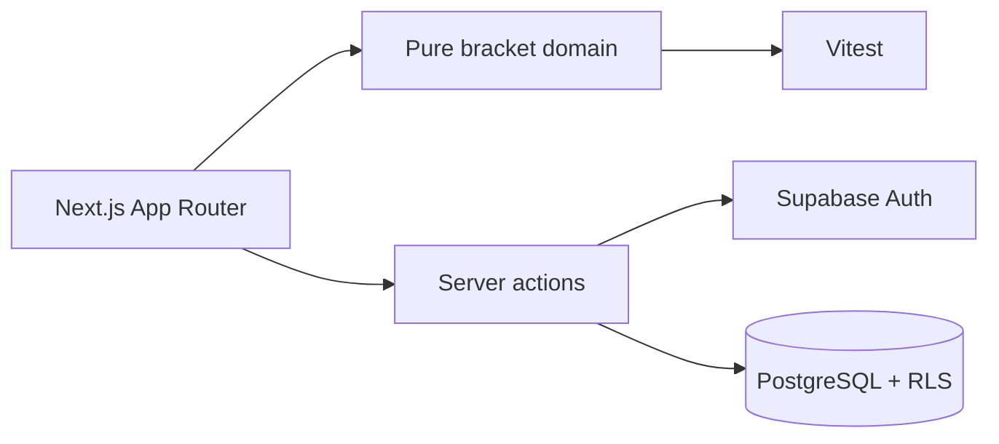

# BracketForge

BracketForge is a tournament operations app for creating, running and sharing
competitive brackets with a polished public arena for spectators.

The project is built with Next.js 16, React 19, TypeScript, Tailwind CSS 4 and
Supabase. It includes Supabase Auth, PostgreSQL migrations with RLS policies,
real-time tournament refreshes and a tested single-elimination engine separated
from the UI.

## Status

Beta-ready foundation. The current scope covers single-elimination tournaments
end to end: account access, draft creation, participant seeding, match results,
automatic advancement, owner controls, private/link/public visibility and
spectator views.

Upcoming product areas include additional formats, exports, richer admin
analytics and collaboration features.

## Features

- Public landing and live arena preview.
- Email/password authentication through Supabase Auth.
- Organizer dashboard with status filters, progress metrics and quick actions.
- Draft creation and editing before launch.
- Single-elimination bracket generation with byes and best-of validation.
- Match result recording with protected owner-only mutations.
- Public, unlisted and private tournament visibility.
- Supabase Realtime refresh for tournament pages.
- PostgreSQL schema, grants and RLS policies versioned in `supabase/migrations`.
- Vitest coverage for bracket domain logic.

## Local Setup

Requires Node.js 20.9 or newer. The app has been verified with Node 24.

```bash
npm install
cp .env.example .env.local
npm run dev
```

On Windows PowerShell:

```powershell
Copy-Item .env.example .env.local
npm run dev
```

Without Supabase credentials, the landing page and arena preview are still
available. Authentication, persistence and owner dashboards require a Supabase
project.

The local development script uses Webpack because Turbopack 16.2.10 can hit an
intermittent Windows package-resolution panic. `npm run dev:turbo` is available
for manual Turbopack checks.

## Environment

Only browser-safe public Supabase values belong in `.env.local`:

```bash
NEXT_PUBLIC_SITE_URL=http://localhost:3000
NEXT_PUBLIC_SUPABASE_URL=https://your-project.supabase.co
NEXT_PUBLIC_SUPABASE_PUBLISHABLE_KEY=your-publishable-key
```

Do not commit `.env.local`, database passwords, JWT secrets, service-role keys
or private API keys. `.gitignore` blocks local env files by default.

## Supabase

1. Create a Supabase project.
2. Copy the project URL and publishable key into `.env.local`.
3. Run the migrations in `supabase/migrations` in timestamp order through SQL
   Editor or Supabase CLI.
4. Configure local redirects for `http://localhost:3000/**`.
5. For production, set the same public env vars in the deployment provider.

The migrations enable RLS and Realtime for tournament data. Public and unlisted
tournaments are readable by spectators, private tournaments stay owner-only and
write operations are protected by ownership checks.

## Quality

```bash
npm run typecheck
npm run lint
npm test
npm run build
npm run format:check
```

## Architecture



- `src/app`: routes, server actions and page composition.
- `src/components`: reusable visual components.
- `src/domain`: framework-independent tournament rules.
- `src/lib/supabase`: Supabase client setup for browser, server and middleware.
- `supabase/migrations`: versioned database model, grants and policies.

## Deployment

Import the repository into Vercel or another Next.js-compatible platform,
configure the public variables listed in `.env.example` and deploy from `main`.

Supabase and the hosting provider both have usage limits. Review current limits
before running high-traffic events.

## Security

No production secrets are required in this repository. Rotate any key that has
been pasted into chats, logs, screenshots or issue trackers before using the
project in production.

## License

No open-source license has been selected yet. The source is visible for review
and portfolio evaluation; reuse or redistribution requires permission from the
repository owner.
