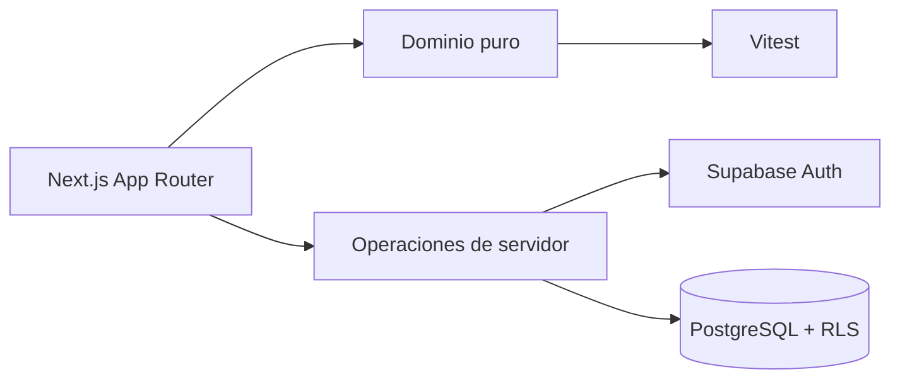

# BracketForge

> Crea, gestiona y comparte torneos de forma rápida, visual y profesional.

Base funcional de una plataforma de torneos construida con Next.js 16, React 19, TypeScript estricto, Tailwind CSS 4 y Supabase. Incluye landing responsive, panel, asistente inicial, edición de drafts, demo pública, esquema PostgreSQL con RLS y un motor puro y probado de eliminación simple.

## Inicio local

Requiere Node.js 20.9 o superior (se ha verificado con Node 24).

```bash
npm install
copy .env.example .env.local
npm run dev
```

Sin credenciales de Supabase se pueden explorar la landing, el dashboard, la demo y el asistente local. La persistencia y autenticación requieren un proyecto Supabase Free.

El servidor local usa Webpack en desarrollo porque Turbopack 16.2.10 puede provocar un panic intermitente en Windows con `Next.js package not found`. Para probar Turbopack manualmente existe `npm run dev:turbo`.

## Supabase

1. Crea un proyecto gratuito.
2. Copia URL y publishable key a `.env.local`.
3. Ejecuta las migraciones de `supabase/migrations` en orden desde SQL Editor o mediante Supabase CLI.
4. Configura `http://localhost:3000/**` como URL de redirección local.
5. Nunca expongas la service-role key en el navegador.

Las migraciones activan RLS: los torneos públicos y no listados son legibles por enlace, los privados quedan reservados al propietario y las mutaciones quedan protegidas por dueño.

## Calidad

```bash
npm run typecheck
npm run lint
npm test
npm run build
npm run format:check
```

## Arquitectura



- `src/app`: rutas y composición de UI.
- `src/components`: componentes visuales reutilizables.
- `src/domain`: reglas independientes de React e infraestructura.
- `src/lib/supabase`: clientes de infraestructura.
- `supabase/migrations`: modelo versionado y políticas RLS.

## Decisiones y límites actuales

El motor de bracket genera conexiones y byes como slots vacíos, conservando toda la lógica fuera de React. La creación, edición de drafts, panel, resultados y avance de eliminación simple usan Supabase. Doble eliminación, Realtime, exportación y colaboración pertenecen a los siguientes bloques; no están simulados ni anunciados como terminados.

## Despliegue

Importa el repositorio en Vercel, configura las tres variables de `.env.example` y despliega sin cambios de código. Supabase y Vercel ofrecen planes gratuitos; revisa sus límites vigentes antes de un evento con tráfico elevado.

## Licencia

Pendiente de seleccionar junto con la documentación comunitaria del bloque de finalización. Se recomienda MIT.
